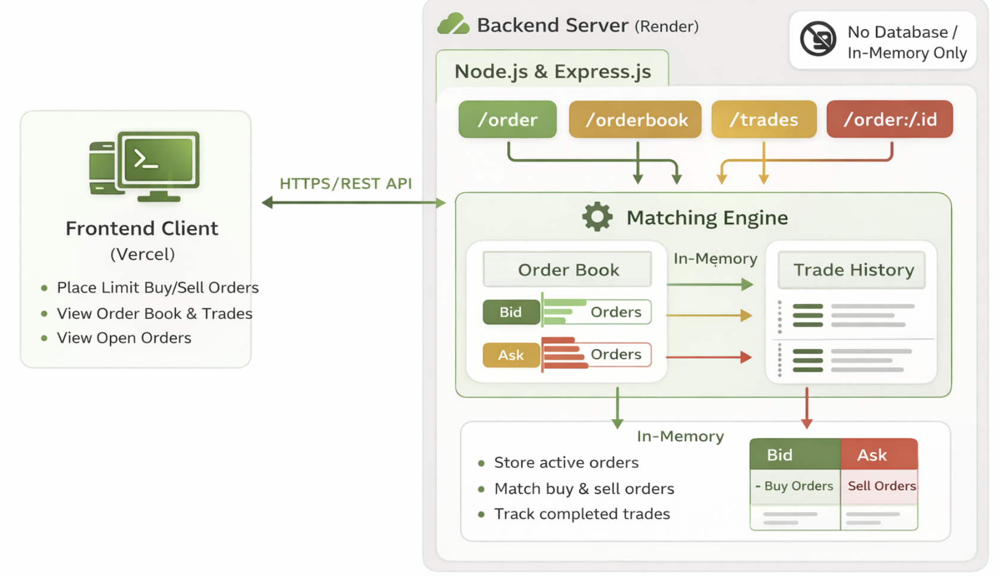
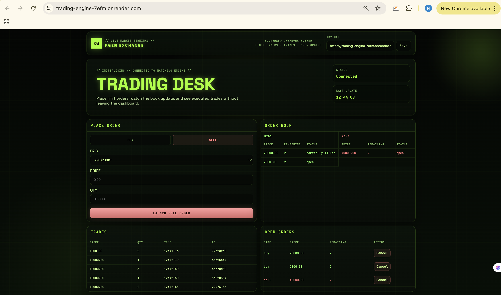
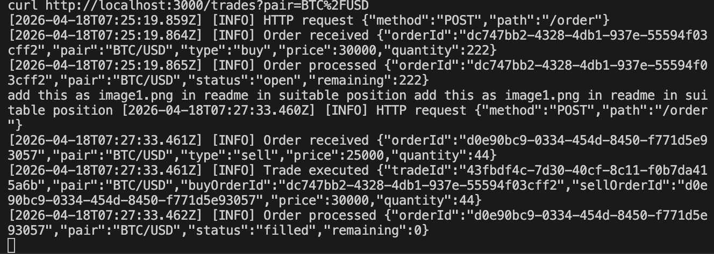

# Trading Engine

Simplified in-memory trading engine with:
- Express backend
- Matching engine (price-time priority)
- Trading dashboard frontend

No database is used. All state resets when server restarts.

## Features

- Place limit buy/sell orders
- Match orders using price priority, then FIFO time priority
- Partial fills and full fills
- Cancel open or partially-filled orders
- Separate order books per trading pair
- Executed trade history
- Terminal logs for order/trade lifecycle

## Supported Pairs

Exactly 2 pairs are configured:
- `BTC/USD`
- `KGEN/USDT`

Source: `config/marketConfig.js`

## Tech Stack

- Node.js
- Express.js
- UUID
- Vanilla JS frontend (modular components)

## Architecture



## Screenshots

### Homepage



The main trading dashboard showing the order form, order book (bid/ask), trades history, and open orders panel.

### Backend Logs



Terminal logs showing successful order placement, matching, and trade execution with full request/response flow.

## Assumptions

- Only **limit orders** are supported (no market orders).
- The system uses an **in-memory order book** (no database).
- Data is **not persistent** and resets on server restart.
- Orders are processed **synchronously** (no concurrency handling).
- Each order belongs to a **single trading pair** (e.g., BTC/USD).
- No user authentication (orders are anonymous).
- No fees, commissions, or slippage are considered.
- Orders cannot be modified once placed (only cancel or execute).

## Matching Logic

The engine follows **price-time priority**:

### Price Priority
- Buy orders match with the **lowest sell price**
- Sell orders match with the **highest buy price**

### Time Priority (FIFO)
- Orders at the same price level are matched in the order they were placed

### Incoming Buy Order

- Matches with sell orders where `sell.price <= buy.price`

- Process:
  1. Select lowest priced sell orders first
  2. For same price, use FIFO
  3. Continue until:
     - Buy order is fully filled, or
     - No matching sell orders remain

### Incoming Sell Order

- Matches with buy orders where `buy.price >= sell.price`

- Process:
  1. Select highest priced buy orders first
  2. For same price, use FIFO
  3. Continue until:
     - Sell order is fully filled, or
     - No matching buy orders remain

### Trade Execution

- Trade quantity = `min(buy.remaining, sell.remaining)`
- Trade price = price of the resting order

### Partial Fills

- If quantities differ:
  - Smaller order is fully filled and removed
  - Larger order remains with updated quantity
- Order status updates:
  - `open` → `partially_filled` → `filled`

### No Match

- If no suitable match is found, the order remains in the order book as `open`

## Example Matching Scenario

Existing Sell Orders:
- Sell 2 @ 100
- Sell 5 @ 101

Incoming Buy Order:
- Buy 5 @ 101

Matching:
- Matches 2 @ 100
- Matches 3 @ 101

Result:
- First sell order is fully filled and removed
- Second sell order remains with quantity 2
- Buy order is fully filled

### Data Flow

1. **Order Placement**: Frontend sends POST /order → Backend validates → Matching Engine processes → Trade created if matched
2. **Order Book**: Frontend polls GET /orderbook → Returns live bid/ask orders per pair
3. **Trades**: Frontend polls GET /trades → Returns executed trades per pair
4. **Cancellation**: Frontend sends DELETE /order/:id → Backend updates order status

### Storage

All data stored in-memory:
- `orderBook`: Maps pair → {bid orders, ask orders}
- `trades`: Array of executed trades
- `ordersById`: Historical order lookup

Data is **NOT persisted**. Server restart clears all state.

## Project Structure

```text
trading_engine/
├── app.js
├── config/
│   └── marketConfig.js
├── controllers/
│   └── orderController.js
├── engine/
│   └── matchingEngine.js
├── models/
│   ├── Order.js
│   └── Trade.js
├── routes/
│   └── orderRoutes.js
├── services/
│   └── orderBookService.js
├── utils/
│   └── logger.js
├── public/
│   ├── index.html
│   ├── style.css
│   ├── app.js
│   ├── api.js
│   └── components/
│       ├── orderForm.js
│       ├── orderBook.js
│       ├── trades.js
│       ├── openOrders.js
│       └── toasts.js
└── README.md
```

## Run Locally

```bash
npm install
npm start
```

Default server:
- `http://localhost:3000`

## Live Deployment

The trading engine is deployed and live on Render:

🚀 **https://trading-engine-7efm.onrender.com/**

Access the trading dashboard directly from the link above. All API endpoints are operational.

API base URL (deployed):

- `https://trading-engine-7efm.onrender.com`

Health check:

```bash
curl -s https://trading-engine-7efm.onrender.com/health
```

Expected:

```json
{"status":"ok"}
```

## API Endpoints

### `POST /order`
Place order.

Request body:

```json
{
  "pair": "BTC/USD",
  "type": "buy",
  "price": 100,
  "quantity": 5
}
```

### `DELETE /order/:id`
Cancel order (only `open` or `partially_filled`).

### `GET /orderbook`
Get order book.

Optional pair filter:
- `GET /orderbook?pair=BTC%2FUSD`

### `GET /trades`
Get executed trades.

Optional pair filter:
- `GET /trades?pair=KGEN%2FUSDT`

### `GET /pairs`
Get configured pairs.

## Frontend Notes

Open `http://localhost:3000`.

Dashboard includes:
- Place Order panel (pair, buy/sell tabs, price, quantity)
- Order book (bids/asks)
- Trades table
- Open orders with cancel button
- Loading, empty, and toast states

### API URL in UI

Top bar has `API URL` input. Default is current origin (typically `http://localhost:3000`).

If backend runs elsewhere (example `http://localhost:5000`):
1. Enter that URL in `API URL`
2. Click `Save`

## Sample cURL

```bash
# Pairs
curl -s http://localhost:3000/pairs

# Place buy order
curl -s -X POST http://localhost:3000/order \
  -H "Content-Type: application/json" \
  -d '{"pair":"BTC/USD","type":"buy","price":101,"quantity":5}'

# Place sell order
curl -s -X POST http://localhost:3000/order \
  -H "Content-Type: application/json" \
  -d '{"pair":"BTC/USD","type":"sell","price":100,"quantity":2}'

# Orderbook for pair
curl -s 'http://localhost:3000/orderbook?pair=BTC%2FUSD'

# Trades for pair
curl -s 'http://localhost:3000/trades?pair=BTC%2FUSD'

# Cancel order
curl -s -X DELETE http://localhost:3000/order/<ORDER_ID>
```

## Logging

Logs print to backend terminal (`npm start` terminal):
- Server start
- HTTP order/cancel requests
- Order received/processed
- Trade executed
- Cancel success/failure

## Troubleshooting

### Error: `EADDRINUSE: port 3000`
Another process is already using port 3000.

```bash
pkill -f "node app.js" || true
npm start
```

Or inspect port:

```bash
lsof -nP -iTCP:3000 -sTCP:LISTEN
```

### Site not reachable
- Ensure backend is running (`npm start`)
- Use `http://localhost:3000` (not https)
- Verify health endpoint

### Frontend shows fetch errors
- Check backend health
- Ensure API URL in UI points to running backend
- Check CORS/network restrictions if using different origin

## Limitations

- In-memory only; no persistence
- Not production-hardened (no auth/rate limiting)
- `ordersById` keeps historical orders in memory until restart

## Future Improvements

- Add user authentication (JWT-based)
- Associate orders with user accounts
- Persist order book and trades using a database
- Real-time updates using WebSockets
